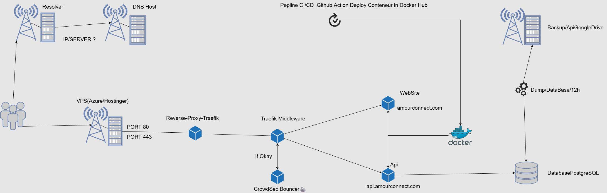
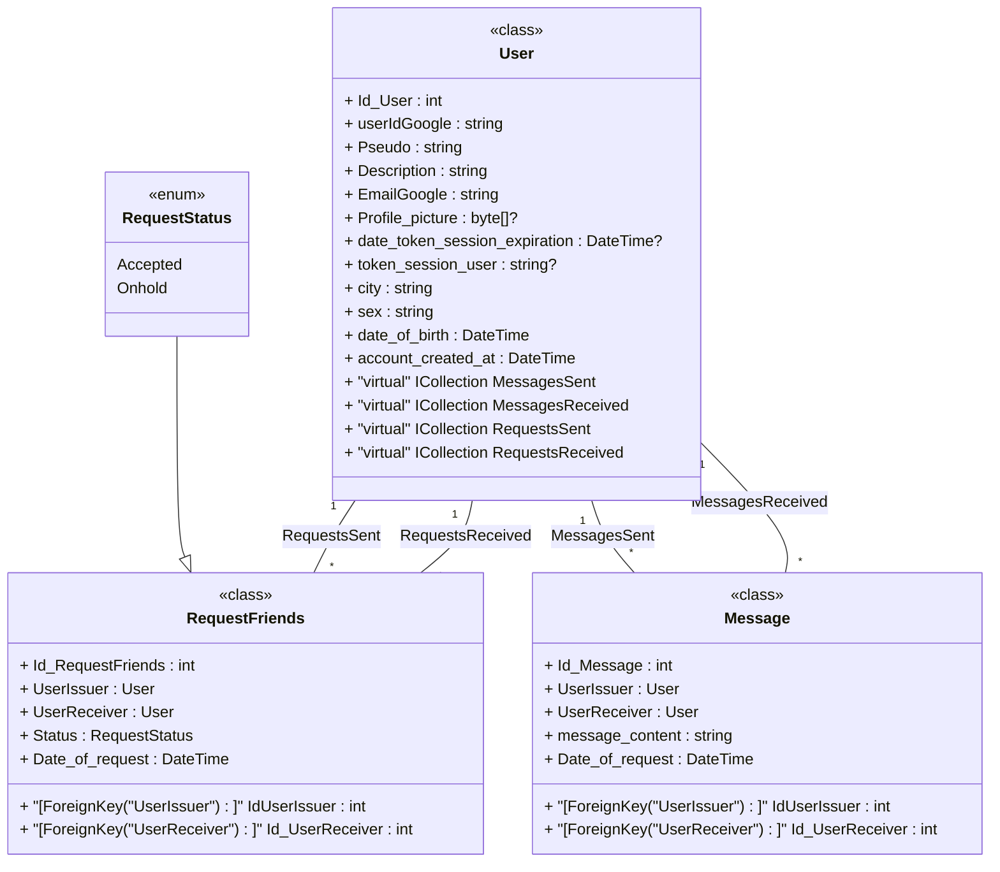

# Projet AmourConnect - BackEND - API in ASP.NET Core C#


<p align="center">
  
</p>

The AmourConnect Server project contains the APIs, database, and other basic infrastructure elements needed for the backend of all AmourConnect client applications.

The server project is written in C# using .NET Core with ASP.NET Core.

# Schema DevOps



# UML Class diagram

# To start API

## Deploy

You can deploy AmourConnect using Docker containers on Windows, macOS, and Linux distributions.

<p align="center">
    
  </a>
</p>

### Requirements

- [Docker](https://www.docker.com/community-edition#/download)
- [Docker Compose](https://docs.docker.com/compose/install/) (already included with some Docker installations)

### *⛔ Start the Database first before (in the folder DataBase)*


*If you use Docker, update the .env config =>*

```
ConnectionDB="Host=postgresdbsqlamourconnect;Port=5432;Username=tchoulo;Password=123tchoulo123;Database=amourconnect_dev;"
```

Start API .NET Core with Docker
```
docker compose -f .\compose.yaml up -d
```

**Clean the caches if that doesn't work :**

```
docker builder prune --force
```

**Otherwise do this manually if you don't have Docker**

*To play Migration (not necessary) in VS => Tools/Nuget Package Manager/ Package Manager Console. After select AmourConnect.Infra*
```
add-migration AmourConnectClass
```

*In prod, when you setup the secrets in Github Action, don't forget to set the connection DB escape special characters in your connection strings to prevent them from being interpreted as command separators in the shell*
```
ConnectionDB="Host=postgresdbsqlamourconnect\;Port=5432\;Username=tchoulo\;Password=123tchoulo123\;Database=amourconnect_dev\;"
```

## Contribute

Code contributions are welcome! Please commit all pull requests to the "main" branch. Please also commit all your development code to the "dev" branch.

Security audits and feedback are welcome. Please open an issue or email us privately if the report is sensitive. You can read our security policy in the [`SECURITY.md`](SECURITY.md) file.

No grant of rights in AmourConnect's trademarks, service marks, or logos is granted (except as may be necessary to comply with applicable notice requirements).
