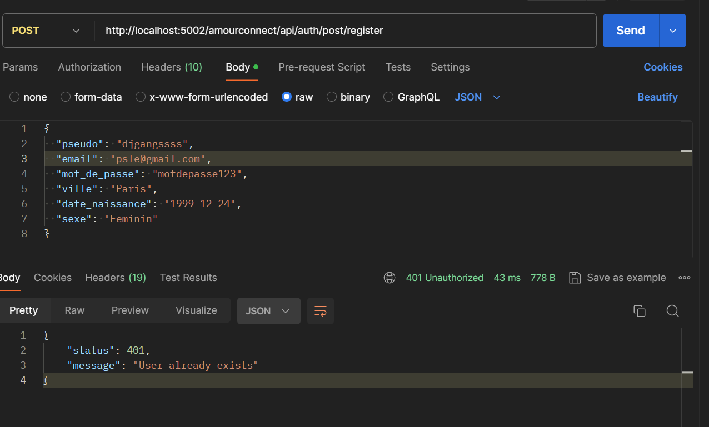

# Example route / Postman / PS: Server responses are in JSON

# AUTH | Login - Register - Welcome - Validate Registration - Session Status

## Test API /GET

-Objective of testing the API

http://localhost:5002/amourconnect/api/auth/get/testo

*- The positive message from the server:*

{ status: 200, message: 'Welcome to the AmourConnect API' }

*- The possible error message :*

{ status: 401, message: error.message }

## To know if the user is connected or not /GET

http://localhost:5002/amourconnect/api/auth/get/SessionStatus

HEADER {
    KEY => Cookie-user-AmourConnect, Value => 'le cookie'
}

*- The positive message from the server:*

{ status: 200, message: 'User connected' }

*- The possible error message :*

{ status: 401, message: Session expired }
{ status: 401, message: User not connected }

## Traiter le formulaire de pré-inscription /POST

http://localhost:5002/amourconnect/api/auth/post/register

HEADER {
    KEY => Cookie-user-AmourConnect, Value => 'le cookie'
}

BODY {
  "pseudo": "djgang",
  "email": "pvd@gmail.com",
  "mot_de_passe": "motdepasse123",
  "ville": "Paris",
  "date_naissance": "1999-12-24",
  "sexe": "Feminin"
}

*- The positive message from the server:*

{ status: 200, message: 'Pre-Registration completed successfully and send email to validate registration' }

*- The possible error message :*

{ status: 401, message: error.message }

## Process the validation of the registration validation form /POST

http://localhost:5002/amourconnect/api/auth/post/validate_registration

HEADER {
    KEY => Cookie-user-AmourConnect, Value => 'le cookie'
}

BODY {
  "email": "pvd@gmail.com",
  "Token_validation_email":"TOKEN_RECU par email ou regarder dans la base de données dans pgadmin"
}

*- The positive message from the server:*

{ status: 200, message: 'Registration completed successfully :)' , key_secret: value_cookie.key_secret, date_expiration: value_cookie.date_expiration}

*- The possible error message :*

BODY { "status": 401, "message": "User not found" }

<!-- ## Traiter le formulaire connexion /POST

http://localhost:5002/amourconnect/api/auth/post/connexion

HEADER {
    KEY => Cookie-user-AmourConnect, Value => 'le cookie'
}

BODY {
  "email":"zbe@gmail.com",
  "mot_de_passe":"zezd"
}

*- The positive message from the server:*

{ status: 200, message: 'Connexion effectuée avec succès', key_secret: value_cookie.key_secret, date_expiration: value_cookie.date_expiration}

*- The possible error message :*

{ status: 401, message: error.message }

# PARTIE Membre ROUTE PRIVE (Faut être connectée) | Accueil Membre - Profil

## Afficher page Accueil Membre /GET

http://localhost:5002/amourconnect/api/membre/get/page_accueil

HEADER {
    KEY => Cookie-user-AmourConnect, Value => 'le cookie'
}

*- The positive message from the server:*

{
status: 200,
message: `Utilisateur bien connecté, affiche la page accueil membre. Voici des utilisateurs pour matcher => `,
user_to_match: user_to_match,
donnees_utilisateur_connecte: donnees_utilisateur_connecte
}

OU

{
status: 200,
message: `Utilisateur bien connecté. Malheureusement, aucun utilisateur trouvé en fonction du sexe opposé, ville, date de naissance (entre moins ou plus de 5 ans) :/`
}

*- The possible error message :*

{ status: 401, message: error.message } -->