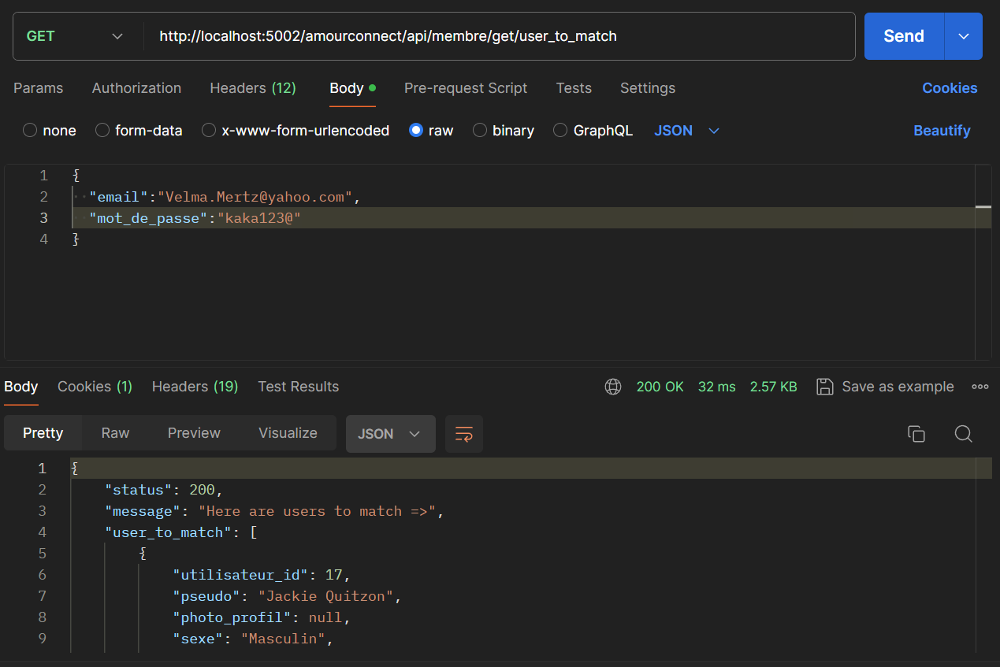
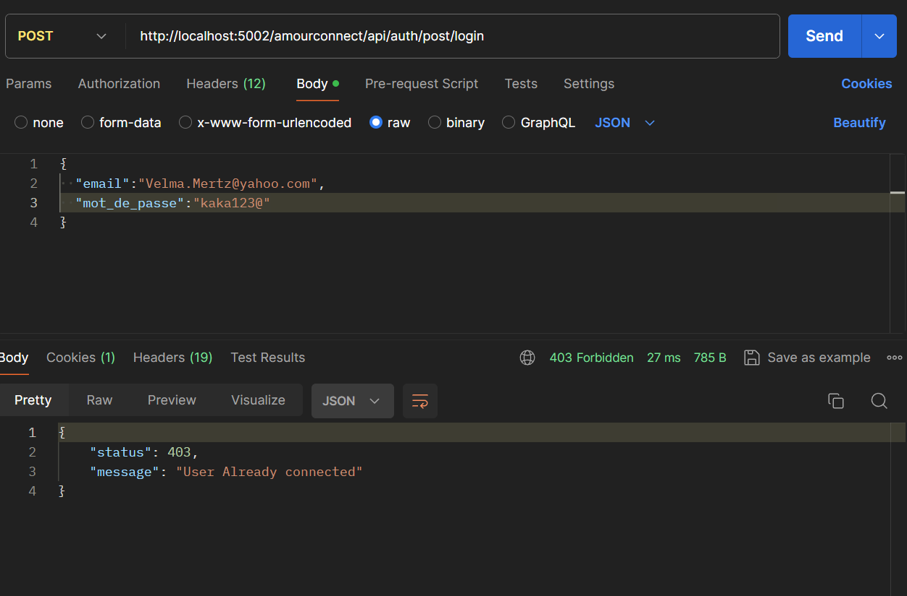

# Example route / Postman / PS: Server responses are in JSON

# AUTH | Login - Register - Validate Registration - Session Status

## To know if the user is connected or not /GET

http://localhost:5002/amourconnect/api/auth/get/SessionStatus

fetch('https://domain', {
  credentials: 'include',
})

*- The positive message from the server:*

{ status: 200, message: 'User connected' }

*- The possible error message :*

{ status: 403, message: Session expired }
{ status: 500, message: 'Internal Server Error' }

## Process the pre-registration form /POST

http://localhost:5002/amourconnect/api/auth/post/register

fetch('https://domain', {
  credentials: 'include',
})

BODY {
  "pseudo": "djgang",
  "email": "pvd@gmail.com",
  "mot_de_passe": "motdepasse123",
  "ville": "Paris",
  "date_naissance": "1999-12-24",
  "sexe": "Feminin"
}

*- The positive message from the server:*

{ status: 200, message: 'Pre-Registration completed successfully and send email to validate registration' }

*- The possible error message :*

{ status: 500, message: 'Internal Server Error' }

## Process the validation of the registration validation form /POST

http://localhost:5002/amourconnect/api/auth/post/validate_registration

fetch('https://domain', {
  credentials: 'include',
})

BODY {
  "email": "pvd@gmail.com",
  "Token_validation_email":"TOKEN_RECU par email ou regarder dans la base de données dans pgadmin"
}

*- The positive message from the server:*

{ status: 200, message: 'Registration completed successfully :)'}

*- The possible error message :*

{ status: 500, message: 'Internal Server Error' }

## Process the connection form /POST

http://localhost:5002/amourconnect/api/auth/post/login

fetch('https://domain', {
  credentials: 'include',
})

BODY {
  "email":"zbe@gmail.com",
  "mot_de_passe":"zezd"
}

*- The positive message from the server:*

{ status: 200, message: 'Connection completed successfully'}

*- The possible error message :*

{ "status": 403, "message": "User Already connected" }
{ status: 500, message: 'Internal Server Error' }

# PRIVATE ROUTE Member PART (Must be connected) | Home Member - Profil

## Get user to match /GET

http://localhost:5002/amourconnect/api/membre/get/user_to_match

fetch('https://domain', {
  credentials: 'include',
})

*- The positive message from the server:*

{ status: 200, message: `Here are users to match =>`, user_to_match: data_to_match, donnees_utilisateur_connecte: data_user }

OR

{ status: 200, message: `Unfortunately, no users found based on opposite gender, city, date of birth (between less or more than 5 years old) :/` }

*- The possible error message :*

{ status: 500, message: 'Internal Server Error' }