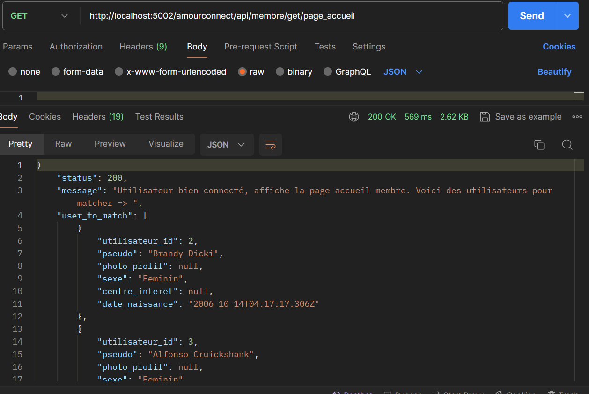
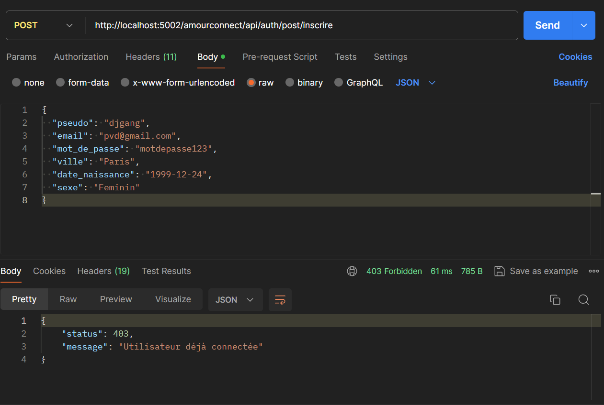

# Exemple de route / Postman / PS : Les réponses serveurs sont en JSON

# PARTIE AUTHENTIFICATION | Connexion - Inscription - Accueil - Valider Inscription - Etat Session

**Teste de l'API /GET**

-Objectif de faire un teste sur l'API

http://localhost:5002/amourconnect/api/auth/get/testo

*- Le message positif du serveur :*

{ status: 200, message: 'Bienvenu sur l'API de AmourConnect' }

*- Le message d'erreur possible :*

{ status: 500, message: 'Erreur interne du serveur -_-' }

**Connaître l'état de session de l'utilisateur /GET**

http://localhost:5002/amourconnect/api/auth/get/etat_session

HEADER {
    KEY => Cookie-user-AmourConnect, Value => 'le cookie'
}

*- Le message positif du serveur :*

{ status: 200, message: 'Utilisateur connectée' }

OU

{ status: 403, message: `L'utilisateur n'est pas connecté` }
{ status: 401, message: 'Cookie AmourConnect n'existe pas' }
{ status: 404, message: 'Vous n'êtes pas connectée' }
{ status: 403, message: 'Cookie Utilisateur expiré' }

*- Le message d'erreur possible :*

{ status: 500, message: 'Erreur interne du serveur -_-' }

**Traiter le formulaire de pré-inscription /POST**

http://localhost:5002/amourconnect/api/auth/post/inscrire

HEADER {
    KEY => Cookie-user-AmourConnect, Value => 'le cookie'
}

BODY {
  "pseudo": "djgang",
  "email": "pvd@gmail.com",
  "mot_de_passe": "motdepasse123",
  "ville": "Paris",
  "date_naissance": "1999-12-24",
  "sexe": "Feminin"
}

*- Le message positif du serveur :*

{ status: 200, message: 'Pré-Inscription fini avec succès et envoie du mail pour valider l'inscription' }

*- Le message d'erreur possible :*

{ status: 400, message:'le paramètre email est manquant (null ou undefined)' }
{ status: 400, message:'regex L'email n'est pas correcte' }
{ status: 400, message:'le paramètre pseudo est manquant (null ou undefined)' }
{ status: 400, message:'la regex Pseudo n'est pas correcte, un pseudo de 3 à 10 caractères (A-z-0-9)' }
{ status: 400, message:'le paramètre mot_de_passe est manquant (null ou undefined)' }
{ status: 400, message:'la regex mot_de_passe n'est pas correcte un mot de passe de 4 à 99 caractères est requis' }
{ status: 400, message: 'le paramètre sexe est manquant (null ou undefined)' }
{ status: 400, message:'la regex sexe n'est pas valide Masculin|Feminin' }
{ status: 400, message: 'le paramètre date de naissance est manquant (null ou undefined)' }
{ status: 400, message:'la regex date de naissance n'est pas valide (YYYY-MM-DD)' }
{ status: 400, message: 'le paramètre ville est manquant (null ou undefined)' }
{ status: 400, message:'la regex ville n'est pas valide (3, 50 caractères)' }
{ status: 401, message: 'Email ou Pseudo Existe déjà dans la table inscription' }
{ status: 401, message: 'Email ou Pseudo Existe déjà dans la table utilisateur' }
{ status: 500, message: 'Erreur interne du serveur -_-' }

**Traiter la validation du formulaire pré-inscription /POST**

http://localhost:5002/amourconnect/api/auth/post/valider_inscription

HEADER {
    KEY => Cookie-user-AmourConnect, Value => 'le cookie'
}

BODY {
  "email": "pvd@gmail.com",
  "Token_validation_email":"TOKEN_RECU par email ou regarder dans la base de données dans phpmyadmin"
}

*- Le message positif du serveur :*

{ status: 200, message: 'Inscription finie avec succès :)' , cle_secret: value_cookie.cle_secret, date_expiration: value_cookie.date_expiration}

*- Le message d'erreur possible :*

{ status: 400, message: 'Token expiré'}
{ status: 400, message:'le paramètre email est manquant (null ou undefined)' }
{ status: 400, message:'regex L'email n'est pas correcte' }
{ status: 400, message: 'paramètre Token manquant (null ou undefined)' }
{ status: 400, message:'la regex token n'est pas valide' }
{ status: 404, message: 'Email ou Token invalide pour valider l'inscription' }
{ status: 500, message: 'Une erreur serveur' }
{ status: 500, message: 'Erreur interne du serveur -_-' }

**Traiter le formulaire connexion /POST**

http://localhost:5002/amourconnect/api/auth/post/connexion

HEADER {
    KEY => Cookie-user-AmourConnect, Value => 'le cookie'
}

BODY {
  "email":"zbe@gmail.com",
  "mot_de_passe":"zezd"
}

*- Le message positif du serveur :*

{ status: 200, message: 'Connexion effectuée avec succès', cle_secret: value_cookie.cle_secret, date_expiration: value_cookie.date_expiration}

*- Le message d'erreur possible :*

{ status: 400, message:'le paramètre email est manquant (null ou undefined)' }
{ status: 400, message:'regex L'email n'est pas correcte' }
{ status: 400, message:'le paramètre mot_de_passe est manquant (null ou undefined)' }
{ status: 400, message:'la regex mot_de_passe n'est pas correcte un mot de passe de 4 à 99 caractères est requis' }
{ status: 401, message: 'Mot de passe incorrecte' }
{ status: 404, message: 'L'utilisateur n'existe pas' }
{ status: 500, message: 'Erreur interne du serveur -_-' }

# PARTIE Membre ROUTE PRIVE (Faut être connectée) | Accueil Membre - Profil

**Afficher page Accueil Membre /GET**

http://localhost:5002/amourconnect/api/membre/get/page_accueil

HEADER {
    KEY => Cookie-user-AmourConnect, Value => 'le cookie'
}

*- Le message positif du serveur :*

{
status: 200,
message: `Utilisateur bien connecté, affiche la page accueil membre. Voici des utilisateurs pour matcher => `,
user_to_match: user_to_match,
donnees_utilisateur_connecte: donnees_utilisateur_connecte
}

OU

{
status: 200,
message: `Utilisateur bien connecté. Malheureusement, aucun utilisateur trouvé en fonction du sexe opposé, ville, date de naissance (entre moins ou plus de 5 ans) :/`
}

*- Le message d'erreur possible :*

{ status: 500, message: 'Erreur interne du serveur -_-' }
{ status: 403, message: 'Cookie Utilisateur expiré' }
{ status: 404, message: 'Vous n\'êtes pas connectée' }
{ status: 401, message: 'Cookie AmourConnect n\'existe pas' }