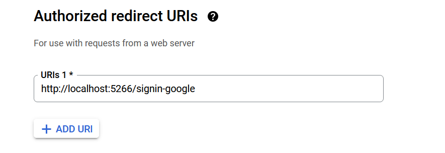

# Projet AmourConnect - BackEND - API in .NET Core

Dating site to match with a man VS woman and look for his love❤️

URL Redirection in Google Console API


# To start API

*⛔ Start the Database first before (in the folder server_api/DataBase)*


*If you use Docker, update the .env config =>*

```
IP_NOW_FRONTEND="http://localhost:3005"
IP_NOW_BACKENDAPI="http://apinetcore:5267"
ConnectionDB="Host=postgresdb;Port=5432;Username=tchoulo;Password=123tchoulo123;Database=amourconnect_dev;"
```

Start API .NET Core
```
docker-compose -f .\compose.yaml up -d
```

**Clean the caches if that doesn't work :**

```
docker builder prune --force
```

```
docker image prune --force
```

**Otherwise do this manually if you don't have Docker**

*To play Migration (not necessary) in VS => Tools/Nuget Package Manager/ Package Manager Console. After select AmourConnect.Infra*
```
add-migration AmourConnectClass
```